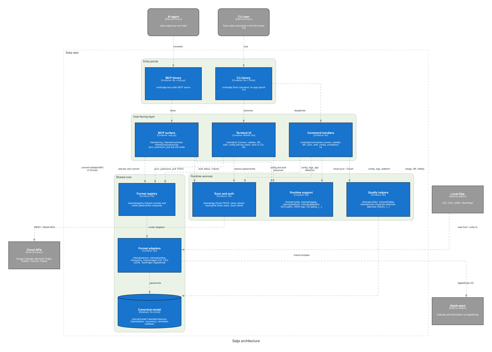

[](https://github.com/gongahkia/salja/releases/tag/1.0.0)


# `Salja`

Universal CLI for converting between calendar and task management formats — ICS, Google Calendar, Outlook, Todoist, TickTick, Notion, Asana, Trello, OmniFocus, and Apple Calendar/Reminders — with conflict detection, fidelity checking, and cloud sync.

## Stack

* *Scripting*: [Go](https://go.dev/), [Cobra](https://github.com/spf13/cobra), [go-keyring](https://github.com/zalando/go-keyring) 
* *Parsing*: [go-ical](https://github.com/emersion/go-ical) 
* *Config files*: [TOML](https://github.com/BurntSushi/toml) 
* *Build*: [GoReleaser](https://goreleaser.com/) 

## What `Salja` can do *([currently](https://github.com/gongahkia/salja/issues))*

### Format Conversion

| Format | Extension | Events | Tasks | Recurrence | Subtasks |
|---|---|---|---|---|---|
| **ICS** | `.ics` | yes | yes | yes | no |
| **Google Calendar** | `.csv` | yes | no | no | no |
| **Outlook** | `.csv` | yes | no | no | no |
| **Todoist** | `.csv` | no | yes | no | yes |
| **TickTick** | `.csv` | no | yes | yes | yes |
| **Notion** | `.csv` | no | yes | no | no |
| **Asana** | `.csv` | no | yes | no | no |
| **Trello** | `.json` | no | yes | no | yes |
| **OmniFocus** | `.taskpaper` | no | yes | no | yes |
| **Apple Calendar** | native | yes | no | no | no |
| **Apple Reminders** | native | no | yes | no | no |

### Cloud Sync (OAuth)

Push/pull to Google Calendar, Microsoft Outlook, Todoist, TickTick, and Notion via authenticated API calls with PKCE OAuth2 flow, token refresh, and secure keyring storage.

### Conflict Detection

Fuzzy duplicate detection using UID matching, Levenshtein title distance, and date proximity heuristics. Configurable resolution strategies: `ask`, `prefer-source`, `prefer-target`, `skip-conflicts`, `fail-on-conflict`.

### Fidelity Checking

Pre-conversion warnings when the target format can't represent source data (subtasks, recurrence rules, reminders, timezones). Modes: `warn` (default), `error`, `silent`.

### Other

* Streaming CSV/ICS parsing for large files (constant memory)
* Locale-aware date parsing (`--locale`)
* Charset auto-detection (UTF-8, UTF-16, Shift-JIS, etc.)
* Partial success mode (some items fail, rest convert)
* Dry-run and JSON output for scripting
* Shell completion (bash/zsh)
* Apple Calendar/Reminders via native AppleScript (macOS only)

## Usage

### Install

```sh
# homebrew
brew install gongahkia/salja/salja

# go install
go install github.com/gongahkia/salja/cmd/salja@latest

# from source
git clone https://github.com/gongahkia/salja.git
cd salja && make install

# nix
nix build .#salja

# docker
docker build -t salja .
docker run --rm salja convert input.ics output.csv --to gcal

# arch linux
makepkg -si
```

### Convert

```sh
# auto-detect formats from file extensions
salja convert calendar.ics tasks.csv --to todoist

# explicit formats
salja convert data.csv output.ics --from gcal --to ics

# dry-run preview
salja convert input.ics output.csv --to gcal --dry-run

# strict mode (fail on data loss)
salja convert input.ics output.csv --to todoist --fidelity error

# merge with conflict detection
salja convert new.ics existing.ics --merge

# apple calendar (macOS)
salja convert tasks.ics output --to apple-calendar --calendar "Work"
```

### Cloud Sync

```sh
# authenticate
salja auth login google
salja auth login notion

# push local file to cloud
salja sync push calendar.ics --to google
salja sync push tasks.csv --to todoist --dry-run

# pull from cloud to local file
salja sync pull --from google --output calendar.ics
salja sync pull --from todoist --output tasks.csv --start 2026-01-01 --end 2026-06-01

# check auth status
salja auth status
```

### Other Commands

```sh
# list supported formats
salja list-formats

# validate a file
salja validate calendar.ics

# diff two files
salja diff old.ics new.ics --format table

# config
salja config init
salja config path

# shell completion
source <(salja completion bash)
salja completion zsh > ~/.zfunc/_salja
```

### Configuration

Config lives at `$XDG_CONFIG_HOME/salja/config.toml` (default `~/.config/salja/config.toml`).

```toml
preferred_mode = "file"
default_timezone = "UTC"
conflict_strategy = "ask"
data_loss_mode = "warn"
streaming_threshold_mb = 10
api_timeout_seconds = 30

[conflict_thresholds]
levenshtein_threshold = 3
min_title_length = 10
date_proximity_hours = 24

[api.google]
client_id = ""
client_secret = ""
redirect_uri = ""
```

## Architecture

<div align="center">
    
</div>

## Reference

The name `Salja` is in reference to...
